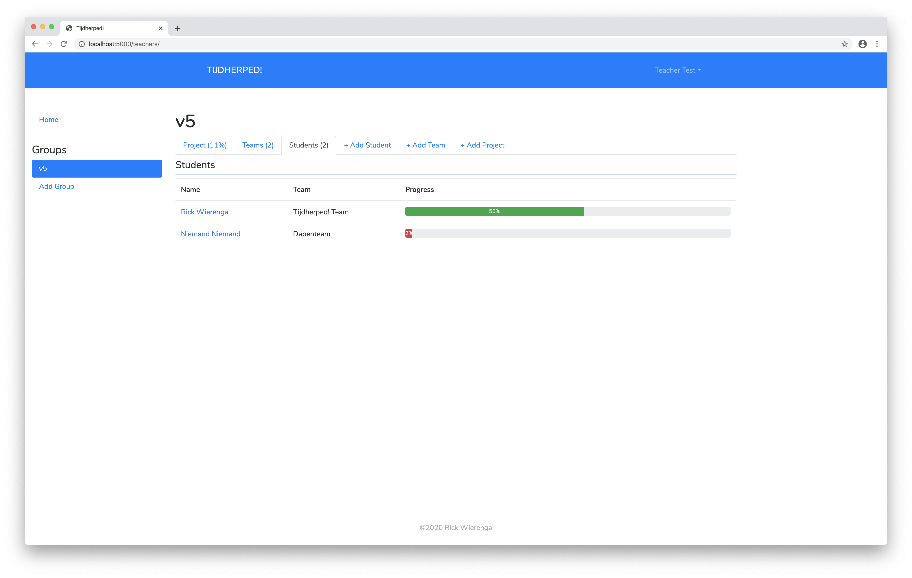
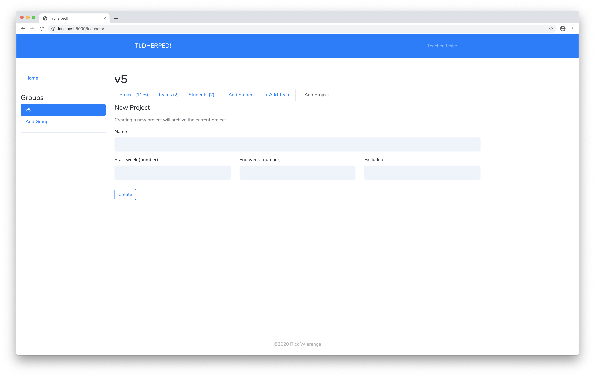
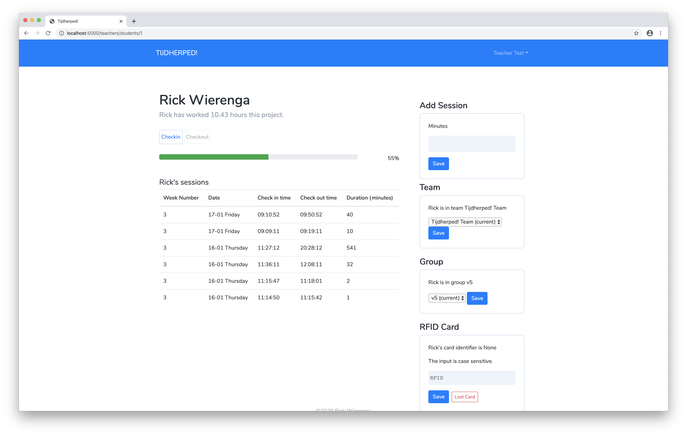
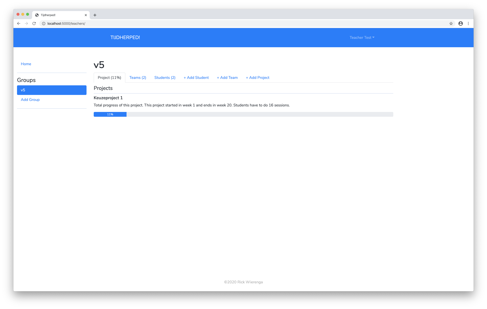

# Tijdherped!

Attendance management system.

## Installation

```sh
python3 -m virtualenv env
source env/bin/activate
pip3 -r install requirements.txt
```

tested on a raspberry pi 3b

## Demo

Video: https://youtu.be/tFdpWRlZjxw.







## API Docs
### Checkin
`POST /api/v1/student/checkin`

Check a user in.

**Args**:

`rfid` user's rfid

or

`id=`user's id

**Returns**

`200 OK` on success.
```json
{
    "message": string
}
```

`400 Bad Request` if there is no `rfid` or `id` parameter.

`404 Not Found` if student is not found.

### Checkout
`POST /api/v1/student/checkout`

Check a user out.

**Args**:

`rfid` user's rfid

or

`id` user's id

**Returns**

`200 OK` on success.
```json
{
    "message": string
}
```

`400 Bad Request` if there is no `rfid` or `id` parameter.

`404 Not Found` if student is not found.

---
&copy; Rick Wierenga
